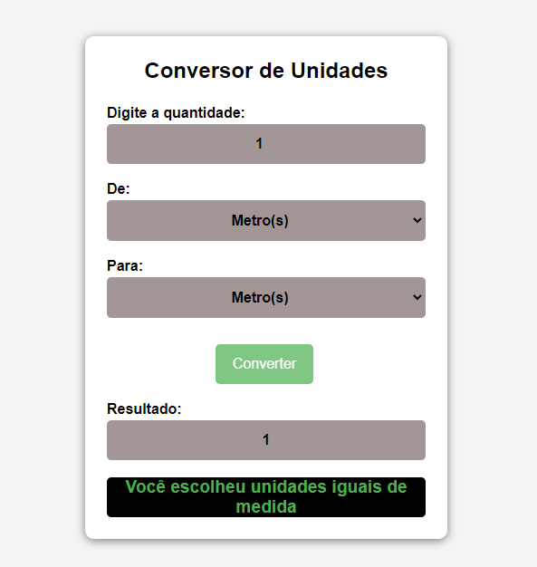

# Conversor de Unidades

## 1 - O que ele faz?😅
* converte unidades simples de medidas
* quando solicitado a mesma medida informa ao usuário
* trabalha com metros, centimetros, milimetros, quilomentros

## 2 - Como foi construído👨‍💻👨‍🔧
* Construindo o corpo com html básico onde o usuário basta digitar o valor escolher a unidade de medida de entrada e saida e clicar no botão
* Agilizar a condtrução usando o EMET no VS Code, assim criando um corpo de um arquivo HTML
* CSS foi usado para alinhar a otimizar a visualização.
* JS foi usado para criar a implementar a lógica onde pegamos o inout de entrada e convertemos ele para metros assim evitando diversas contas a serem feitas e deixando o código mais fácl de se ler e aplicar manutenção

## 3 - Ideias para Otimizar esse Mini Projeto💡💡
* mais medidas a serem implementadas
* otimizar o CSS

## Preview deste Mini Projeto
