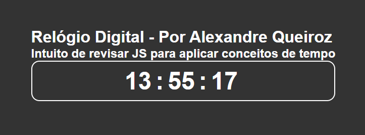

# Relógio Digital

## 1 - O que ele faz?😅
* mostra o horário exato na tela

## 2 - Como foi construído👨‍💻👨‍🔧
* Corpo do porjeto em html onde temos 2 div's uma que é o container e a outra que é o relógio.
* Ainda no html o horário foi feito com span e classes para hora, minuto e segundos e tudo isso para que seja possivel manipular com JS.
* CSS básicamente para dar cor ao projeto e deixar ele centralizado na tela.
* Com Js instanciamos a classe DATE que é nativa. Usamos uma variavel para instanciar o objeto DATE e usamos variaveis para armazenar horas, minutos e segundos. EX: ```const now = new Date();``` e aqui um exemplo como captamos as horas: ```const hours = now.getHours().toString().padStart(2, "0");```
* Importante captar as classes para trabalhar com o DOM lembrando que elas foram definidas no HTML assim: ```<span class="hours">00</span>``` e no arquivo JS main.js elas foram manipuladas captando esses elemento do html em <b>variáveis</b> um exemplo seria: ```const hoursElement = document.querySelector(".hours")```.
* Para atualizar os segundos podemos usar a função setInteval(função, tempo de execução) -> o setInterval chama a sua função a partir do tempo de execução definda na chamada da função Ex: ```setInterval(unClock, 1000)```.

## 3 - Ideias para Otimizar esse Mini Projeto💡💡
* despertador onde o usuário pode programar a hora para despertar
* incluir datas e dia da semana.
* potêncial de pomodoro.

## Preview deste Mini Projeto
